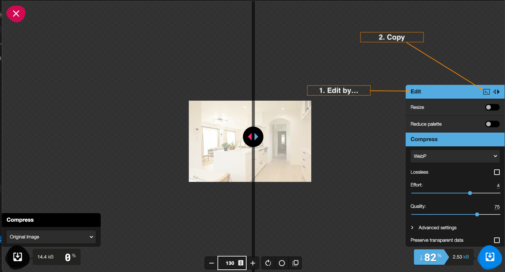

# use easy squoosh cli

Those who want to check how squoosh works in the CLI in a super-easy way.

## command

```
$ docker-compose up -d
```

```
$ docker exec squoosh_cli npm install
```

Command to convert from jpg to webp.
this project to imgs to convImgs

```
$ docker exec squoosh_cli /bin/bash -c " npx @squoosh/cli --webp '{"quality":75,"target_size":0,"target_PSNR":0,"method":4,"sns_strength":50,"filter_strength":60,"filter_sharpness":0,"filter_type":1,"partitions":0,"segments":4,"pass":1,"show_compressed":0,"preprocessing":0,"autofilter":0,"partition_limit":0,"alpha_compression":1,"alpha_filtering":1,"alpha_quality":100,"lossless":0,"exact":0,"image_hint":0,"emulate_jpeg_size":0,"thread_level":0,"low_memory":0,"near_lossless":100,"use_delta_palette":0,"use_sharp_yuv":0}' -d /app/convImgs/ /app/imgs/*jpg"
```

#　 If you want to convert or compress other image formats

https://squoosh.app/

## Stap.1


## Stap.2



2 => Copy result

↓↓↓↓↓↓↓↓

```
npx @squoosh/cli --webp '{"quality":75,"target_size":0,"target_PSNR":0,"method":4,"sns_strength":50,"filter_strength":60,"filter_sharpness":0,"filter_type":1,"partitions":0,"segments":4,"pass":1,"show_compressed":0,"preprocessing":0,"autofilter":0,"partition_limit":0,"alpha_compression":1,"alpha_filtering":1,"alpha_quality":100,"lossless":0,"exact":0,"image_hint":0,"emulate_jpeg_size":0,"thread_level":0,"low_memory":0,"near_lossless":100,"use_delta_palette":0,"use_sharp_yuv":0}'
```

## Stap.3

Place the original file to be converted in the imgs/ directory.

```
$ docker exec squoosh_cli /bin/bash -c " npx @squoosh/cli --webp XXXXXX -d /app/convImgs/ /app/imgs/*YYYY"
```

※1 Replace the Json part of the command copied in "Stap.2" with "XXXXXXX".

※2 YYYY is the extension of the file to be converted.
